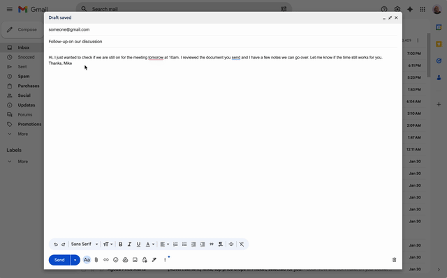
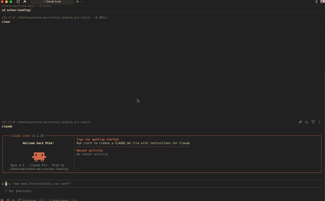
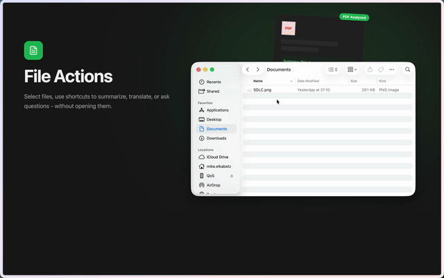
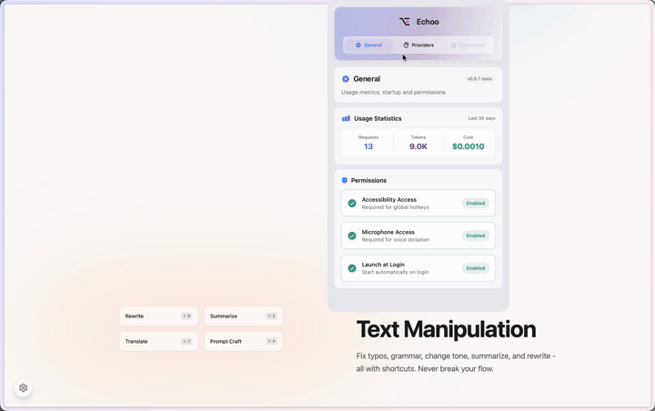

  
  <h1>Echoo</h1>
  
<strong>Stop The Switching.</strong>

  
  

    
    
    
  

  

    <a href="https://www.echoo.ai/echoo.zip"><strong>Download for macOS</strong></a> •
    <a href="#features">Features</a> •
    <a href="#why-i-built-this">Why I Built This</a>
  

---

## Why I Built This

Since the AI revolution began, my workflow changed completely - but not entirely for the better.

I found myself constantly writing content in various apps (Slack, Gmail, Notes, VS Code) and then interrupting my flow to:
1. Copy the text.
2. Switch to a browser tab with ChatGPT or Claude.
3. Paste the text and write a prompt ("Make this more professional," "Fix the grammar," "Translate to English").
4. Wait for the result.
5. Copy the result.
6. Switch back to my original app.
7. Paste it back.

It was exhausting. The constant context switching was killing my focus. I wanted the AI to come to *me*, right where I was working, without the friction.

**That's why I built Echoo.**

Echoo brings AI text transformation directly to your fingertips. Select text anywhere on your Mac, hit a shortcut, and watch it transform instantly. No tab switching. No copy-pasting. Just flow.

## Features

Fix typos, grammar, rewrite in any tone, dictate with voice, and run custom AI prompts via shortcuts. No switching windows. Just flow.

---

### ⚡ Text
Select any text, hit a shortcut, and transform it instantly. Rewrite, summarize, translate, or run custom prompts.

### 🎯 Custom Command
Bring your prompt, select shortcut and execute.

### 🎙️ Voice
Dictate and translate simultaneously. Give voice instructions to edit selected text naturally.

### 📄 Files
Select a PDF, DOC, or TXT file in Finder and summarize, translate, or ask questions about it - without opening it.

### ⚙️ Settings
Customize your experience with ease.

## Privacy First

Your data belongs to you.
- **Local Data**: All your settings and history stay on your machine.
- **No Training**: We do not use your text to train our models.
- **Secure Keys**: Your API keys are stored securely in the macOS Keychain.

## Download

Echoo is 100% free to use.

[**Download for macOS**](https://www.echoo.ai)

*Requires macOS 14 (Sonoma) or later.*

## Feedback & Contributions

Have a bug to report or a feature idea? Use GitHub's built-in tools:

- **Bug Reports**: [Open an Issue](../../issues/new?labels=bug) to report problems or unexpected behavior.
- **Feature Requests**: [Open an Issue](../../issues/new?labels=enhancement) to suggest new features or improvements.
- **Discussions**: Use [GitHub Discussions](../../discussions) for general questions, ideas, or community conversations.

Your input helps make Echoo better!

## Links

- **Website**: [www.echoo.ai](https://www.echoo.ai/)
- **About me**: [mike.org.il](https://mike.org.il)
- **LinkedIn**: [Michael Elkabetz](https://www.linkedin.com/in/michael-elkabetz/)

---

  Built with ❤️ by Michael Elkabetz

