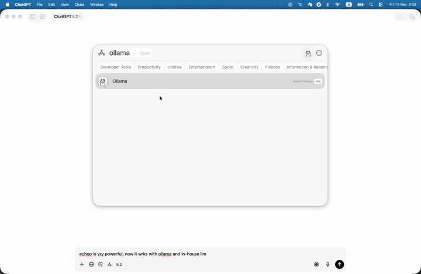
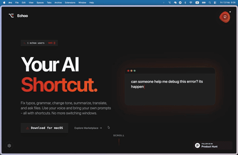

  
  <h1>Echoo</h1>
  
<strong>Your AI assistant, everywhere on macOS.</strong>

  
Select text anywhere, hit a shortcut, and let AI transform it instantly. No browser tabs. No copy-pasting. Just flow.

  

    
    
    
  

  

    <a href="https://www.echoo.ai/echoo.zip"><strong>Download for macOS</strong></a> •
    <a href="#whats-new">What's New</a> •
    <a href="#features">Features</a> •
    <a href="#getting-started">Getting Started</a> •
    <a href="#commands-marketplace">Marketplace</a>
  

   

  

---

## What's New

### Local / In-House LLM Support

Connect Echoo to models running locally with **Ollama**, **LocalAI**, or through a proxy with **LiteLLM**. Your data never leaves your machine and there are zero API costs.

  

### Commands Marketplace

Browse, download, and share AI commands created by the community. Find the perfect command for your workflow or publish your own.

  

---

## Table of Contents

- [What's New](#whats-new)
- [Features](#features)
  - [Text Transformation](#-text-transformation)
  - [Custom Commands](#-custom-commands)
  - [Voice](#-voice)
  - [Files](#-files)
  - [Local LLM Support](#-local-llm-support)
  - [Commands Marketplace](#-commands-marketplace)
  - [Settings](#-settings)
- [Why I Built This](#why-i-built-this)
- [Getting Started](#getting-started)
- [Privacy First](#privacy-first)
- [Community & Contributing](#community--contributing)
- [Links](#links)

---

## Features

### ⚡ Text Transformation

Select any text, hit a shortcut, and transform it instantly. Rewrite, summarize, translate, or run any prompt.

  
    
  

### 🎯 Custom Commands

Create your own prompts, assign a shortcut, and execute anywhere. Your workflow, your rules.

  

### 🎙️ Voice

Dictate text and translate simultaneously. Give voice instructions to edit selected text naturally.

  
    
  

### 📄 Files

Select a PDF, DOC, or TXT file in Finder and summarize, translate, or ask questions about it — without opening it.

  

### 🔒 Local LLM Support

Run AI completely on your machine with **Ollama**, **LocalAI**, or connect through **LiteLLM** proxy. Maximum data security. Zero costs.

  

### 🛒 Commands Marketplace

Download commands created by other users and share your own. The community decides what's useful.

  

### ⚙️ Settings

Customize your experience — providers, models, shortcuts, and more.

  

---

## Why I Built This

Since the AI revolution began, my workflow changed completely — but not entirely for the better.

I found myself constantly writing content in various apps (Slack, Gmail, Notes, VS Code) and then interrupting my flow to:
1. Copy the text.
2. Switch to a browser tab with ChatGPT or Claude.
3. Paste the text and write a prompt ("Make this more professional," "Fix the grammar," "Translate to English").
4. Wait for the result.
5. Copy the result.
6. Switch back to my original app.
7. Paste it back.

It was exhausting. The constant context switching was killing my focus. I wanted the AI to come to *me*, right where I was working, without the friction.

**That's why I built Echoo.**

Echoo brings AI text transformation directly to your fingertips. Select text anywhere on your Mac, hit a shortcut, and watch it transform instantly. No tab switching. No copy-pasting. Just flow.

---

## Getting Started

1. **Download** — Grab the latest version from [echoo.ai](https://www.echoo.ai/echoo.zip).
2. **Install** — Unzip and move Echoo to your Applications folder.
3. **Grant Permissions** — Open Echoo and allow Accessibility access when prompted (required for system-wide text selection).
4. **Use It** — Select text anywhere, press your shortcut, and watch the magic happen.

**Optional:**
- **Connect a Local LLM** — Go to Settings and point Echoo at your Ollama, LocalAI, or LiteLLM endpoint for zero-cost, fully private AI.
- **Browse the Marketplace** — Discover and install community-created commands to supercharge your workflow.

> *Requires macOS 14 (Sonoma) or later.*

---

## Privacy First

Your data belongs to you.

- **Local Data** — All your settings and history stay on your machine.
- **No Training** — Your text is never used to train any models.
- **Secure Keys** — API keys are stored securely in the macOS Keychain.
- **Local LLM Option** — With Ollama or LocalAI, your data never leaves your machine. Zero external API calls.

---

## Community & Contributing

Echoo is growing fast — approaching **1,000 users** through word of mouth alone.

Have a bug to report or a feature idea? We'd love to hear from you:

- **Bug Reports** — [Open an Issue](../../issues/new?labels=bug) to report problems or unexpected behavior.
- **Feature Requests** — [Open an Issue](../../issues/new?labels=enhancement) to suggest new features or improvements.
- **Discussions** — Use [GitHub Discussions](../../discussions) for general questions, ideas, or community conversations.
- **Marketplace** — Share your custom commands with the community and discover what others have built.

Your input helps make Echoo better!

---

## Links

- **Website**: [www.echoo.ai](https://www.echoo.ai/)
- **Commands Marketplace**: [echoo.ai/marketplace](https://www.echoo.ai/marketplace)
- **About Me**: [mike.org.il](https://mike.org.il)
- **LinkedIn**: [Michael Elkabetz](https://www.linkedin.com/in/michael-elkabetz/)

---

  Built with ❤️ by Michael Elkabetz

