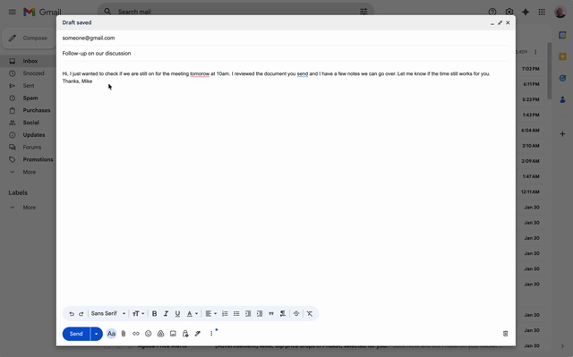
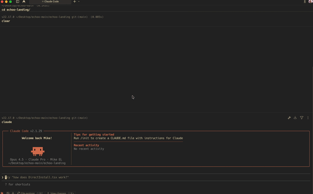
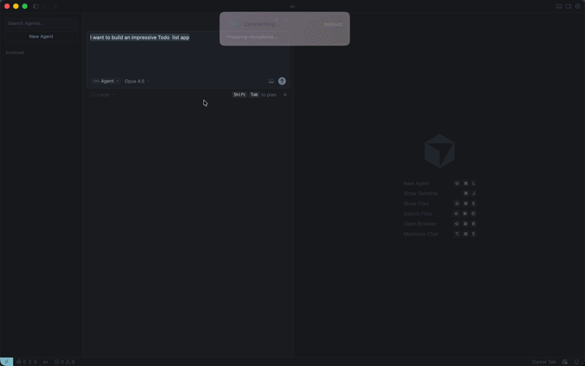
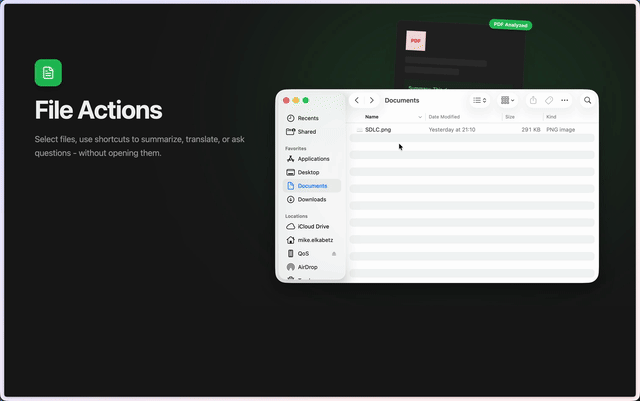
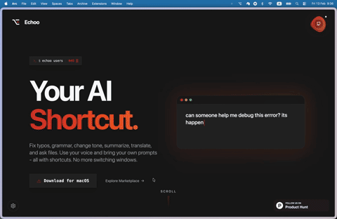

  
  <h1>Echoo</h1>
  
<strong>Use AI in any app without leaving it.</strong>

  
Echoo detects the text you type, executes commands triggered by voice or shortcuts, and returns results inline. Rewrite, proofread, fix grammar, adjust tone, translate, summarize - on text or entire files. Now at <strong>v1.0.5</strong> with faster, more reliable text processing and Screen Context capture.

  

    
    
    
  

  

    <a href="https://www.echoo.ai/"><strong>Download for macOS</strong></a> &middot;
    <a href="https://www.echoo.ai/marketplace">Marketplace</a> &middot;
    <a href="../../issues/new?labels=bug">Report Bug</a> &middot;
    <a href="../../issues/new?labels=enhancement">Request Feature</a>
  

  

    <a href="#core-workflows">Workflows</a> &middot;
    <a href="#bring-your-own-model">Models</a> &middot;
    <a href="#quick-start">Quick Start</a> &middot;
    <a href="#whats-new">What's New</a>
  

   

  

---

### How it works

1. Echoo detects the current text or file
2. Trigger a command by voice or shortcut
3. Get the result back inline

Echoo also adds a **floating rewrite button** for immediate polishing:

1. Select text in any app
2. Click the floating rewrite button
3. Echoo rewrites it inline without interrupting your flow

**BYOK** - Bring your own API key. Your text goes directly to your chosen provider. Echoo never sees your data. Built with Swift and SwiftUI. No Electron. No web views.

---

## Table of Contents

- [Quick Start](#quick-start)
- [Core Workflows](#core-workflows)
  - [Transform text inline](#transform-text-inline)
  - [Dictate and post-process](#dictate-and-post-process)
  - [Run commands on files](#run-commands-on-files)
  - [Commands adapt to text, screen, and voice](#commands-adapt-to-text-screen-and-voice)
- [Bring Your Own Model](#bring-your-own-model)
- [Default Shortcuts](#default-shortcuts)
- [What's New](#whats-new)
- [Why Echoo](#why-echoo)
- [Privacy](#privacy)
- [Keep Echoo Shipping](#keep-echoo-shipping)
- [Community](#community)
- [Links](#links)

---

## Quick Start

1. **Download** - Grab the latest version from [echoo.ai](https://www.echoo.ai/).
2. **Install** - Open the DMG and drag Echoo to Applications.
3. **Set up** - Launch Echoo, grant Accessibility permission, and add your API key.
4. **Use it** - Select text anywhere, press a shortcut, get the result inline.

**Optional:**
- **Local LLM** - Point Echoo at Ollama, LocalAI, or LiteLLM for fully private, zero-cost AI.
- **Voice model** - Download Parakeet v3 (~650 MB) in Settings for on-device speech recognition.
- **Marketplace** - Browse and install community commands at [echoo.ai/marketplace](https://www.echoo.ai/marketplace).

### Permissions

| Permission | Required | Purpose |
|-----------|----------|---------|
| **Accessibility** | Yes | Capture selected text and simulate keyboard shortcuts |
| **Microphone** | Optional | Voice dictation and voice instruction commands |
| **Screen Recording** | Optional | Screen context screenshots for AI processing |

> *Requires macOS 14 (Sonoma) or later.*

---

## Core Workflows

### Transform text inline

Echoo detects the current text automatically, runs the command you trigger by voice or shortcut, and returns the result inline. Fix grammar, proofread, rewrite in a different tone, translate, summarize, or run a custom prompt without breaking flow.

- **Rewrite** (`⌥R` or floating button) - Proofread, fix grammar, and polish. Replaces your selection inline.
- **Summarize** (`⌥S`) - Key points and action items in a popup.
- **Translate** (`⌥T`) - Translate to any language without switching apps.
- **Ask** (`⌥A`) - Ask questions about selected text. Answers in a popup.
- **Prompt Craft** (`⌥P`) - Optimize any prompt using a multi-layer architecture.

Each command can use a different AI provider, model, and temperature.

  
    
  

### Dictate and post-process

Speak the text you want to insert, then optionally run a command before Echoo places the final result in your app. On-device transcription powered by NVIDIA Parakeet v3 - 25 languages, zero cloud dependency.

- **Dictate** (`⌥V`) - Speak and text appears at your cursor. Push-to-talk or toggle mode.
- **Post-processing** - Chain dictation into any command (e.g., dictate then auto-translate to French).
- **Voice Instruct** (`⌥I`) - Instead of dictating content, say what should happen: "Make this shorter" or "Translate this to Spanish."
- **Read Aloud** (`⌥L`) - Select text and hear it spoken aloud. Auto-detects language. Optionally run any AI command before speaking (summarize, translate, simplify). Adjustable speed (0.5x–2x).
- **Voice Launcher** (`⌃` hold) - Hold the Control key, say a command name, and it executes. That now includes **Claude Code Skills**, so repo-aware workflows can start with your voice instead of a terminal command.

  
    
  

### Run commands on files

Select files in Finder and run the same command system on them. Summarize documents, translate content, extract information, or ask questions - without opening each file. Supports PDF, DOC, and TXT.

  

### Commands adapt to text, screen, and voice

In Echoo, commands are reusable system prompts that work across different inputs and outputs. Use them to post-process dictation, add screen context when the answer depends on what you see, or clean up text before Read Aloud plays it back.

- **Custom system prompts** - Write any prompt, assign a shortcut.
- **Text or voice input** - Create text-based or voice-triggered commands.
- **Inline or popup** - Choose whether the response replaces text or appears in a popup.
- **Per-command model** - Assign a different provider and model to each command.
- **Claude Code Skills** - This is the new workflow. Run Claude Code Skills by voice or shortcut, skip the CLI, and get the result back on screen. When needed, Echoo still uses the right folder in the background for repo-aware work.
- **Real skill example** - Ask `/github-trending` for a daily AI-powered summary and Echoo brings back the top repositories, what they do, and why they matter in one compact result.
- **Screen context** - Toggle on to attach a screenshot with any command. AI gets your text + what's on screen. Uses macOS ScreenCaptureKit.
- **Import & export** - Share commands as `.echoo` files or download from the [marketplace](https://www.echoo.ai/marketplace).

  
    
  

(<a href="#table-of-contents">back to top</a>)

---

## Bring Your Own Model

Echoo does not lock you into one provider. Keep the same shortcut and command workflow while choosing the model that fits your privacy, speed, and cost needs.

### Cloud models

Best for reach, speed, and the latest frontier models.

| Provider | Models | Default |
|----------|--------|---------|
| **OpenAI** | GPT-4.1 Nano, GPT-5 Mini, GPT-5.2 | GPT-4.1 Nano |
| **Anthropic** | Claude Haiku 4.5, Claude Sonnet 4.5, Claude Opus 4.6 | Claude Haiku 4.5 |
| **Google** | Gemini 2.5 Flash Lite, Gemini 2.5 Pro, Gemini 3 Pro, Gemini 3 Flash | Gemini 2.5 Flash Lite |

### Local models

Best for privacy, offline use, and full control. Your data never leaves your device.

| Provider | Description |
|----------|-------------|
| **Ollama** | Run open-source models locally (Llama, Mistral, etc.) |
| **LocalAI** | OpenAI-compatible local inference server |
| **LiteLLM** | Proxy for 100+ model providers behind a unified API |

Each command can use a different provider and model. Switch freely per workflow.

(<a href="#table-of-contents">back to top</a>)

---

## Default Shortcuts

All shortcuts use the **Option (⌥)** key and are fully customizable in Settings.

| Shortcut | Command |
|----------|---------|
| `⌥R` | **Rewrite** - Proofread, fix grammar & polish (inline replace) |
| `⌥S` | **Summarize** - Key points (popup) |
| `⌥T` | **Translate** - Translate to chosen language (popup) |
| `⌥A` | **Ask** - Q&A about selected text (popup) |
| `⌥P` | **Prompt Craft** - Optimize a prompt (popup) |
| `⌥V` | **Dictate** - Voice to text (on-device) |
| `⌥I` | **Voice Instruct** - Speak to edit text |
| `⌥L` | **Read Aloud** - Text-to-speech with AI pre-processing |
| `⌃` (hold) | **Voice Launcher** - Say a command name to execute it |

Custom commands get their own shortcuts from a dedicated pool.

(<a href="#table-of-contents">back to top</a>)

---

## What's New

### v1.0.5 - Faster Text Processing

- **Faster command startup** - Processing feedback now appears immediately while text and screen context are captured.
- **More reliable text handling** - Selection capture, inline replacement, and clipboard restoration are more robust under load.
- **Faster Screen Context** - Screenshots are captured and encoded concurrently without blocking text processing.

### v1.0.4 - Screen Context Reliability

- **Reliable capture timing** - Screen Context now captures before text selection can change the active window.
- **Sharper, efficient screenshots** - Retina captures are resized correctly before being attached to AI commands.
- **Attachment handling fixes** - Screen-aware commands now receive screenshots more consistently.

### v1.0.0 - First Official Release

- **Out of beta** - Echoo's first official release. The most complete and stable version yet.
- **Dramatic performance improvements** - Faster processing, lower latency, and smoother workflows across the whole app.
- **Floating rewrite button** - Select text and a floating icon appears. Press it to rewrite inline, no shortcut to remember.
- **No API key required** - Subscribe and Echoo handles the API key for you. BYOK is still fully supported if you prefer your own.
- **Subscription plans**:
  - **300 credits** - ~~$9.99~~ **$6.99/mo** (launch discount)
  - **600 credits** - ~~$12.99~~ **$9.99/mo** (launch discount)

### v0.13.0-beta - Floating Rewrite Button

- **Immediate rewrite** - Select text and use the floating button to polish it inline without remembering a shortcut.

### v0.12.5-beta - Performance Improvements

- **Performance improvements** - Faster processing, reduced latency, and overall stability enhancements across the app.

### v0.12.1-beta - Claude Code Skills

- **A new way to use Claude Code** - Echoo now lets you run **Claude Code Skills** by voice or keyboard shortcut, without opening the CLI first.
- **Results come back on screen** - Instead of jumping into a terminal and breaking flow, you stay in context and get the response directly in Echoo's normal result surface.
- **Fits the rest of Echoo** - Claude Code Skills now feel like part of the same system as text commands, voice workflows, file actions, and screen-aware tasks.

### v0.11.1-beta - Auto Select All & Voice Launcher Control Key

- **Auto select all** - No more `⌘A` before running inline commands. Echoo automatically selects all text when nothing is selected, so you can just press your shortcut and go.
- **Voice Launcher default key changed** - Voice Launcher now defaults to the Control key (⌃) instead of Fn. Hold Control, speak a command name, and it executes. Fully customizable in Settings.

### v0.11.0-beta - Heading to Official Release

Echoo is heading toward its first official release. This is the most complete version yet.

- **Screen Context** - Attach a screenshot to any command so the AI can see what's on your screen. Uses macOS ScreenCaptureKit. Toggle per-command in Settings. Works with built-in, custom, and voice instruction commands. When using voice instruction without selected text, Echoo switches to screen-only analysis mode.
- **Voice Launcher** - Hold a key (default: Control ⌃), speak a command name, and it executes instantly. Works with all built-in commands, custom commands, and marketplace commands. Recognizes variations ("re-write", "summarise", "read out loud"). A voice-activated command palette - no shortcut memorization needed.
- **Read Aloud with AI Pre-Processing** - Select any text and hear it spoken aloud using macOS text-to-speech. Auto-detects language across 25+ languages. Adjustable speed (0.5x-2x). Chain any AI command as a pre-processing step - e.g., summarize an article, translate the summary to French, then hear it read aloud.
- **Undo support** - Every inline text replacement can be undone with `⌘Z`. Echoo restores your original text instantly.
- **Cleaner command management** - Disabled commands are now removed from the active command list, keeping your workspace clean.
- **UX refinements** - Quality-of-life fixes across text processing, clipboard handling, and voice flows.

### v0.10.6 - Model Updates, Voice Engine & Polish

- **Latest models** - Updated to GPT-5.2, Claude Opus 4.6, Gemini 3 Pro/Flash, and more.
- **Voice custom commands** - Create custom commands triggered by voice input.
- **UI refinements** - Improved settings layout, command cards, and overall polish.
- **Dark mode** - Full dark mode support across the entire app.
- **Notch-aligned toasts** - Processing and error notifications align elegantly with the macOS notch.
- **Onboarding** - Guided first-run experience for permissions, API key, and command overview.
- **Completion sound** - Optional audio feedback when processing finishes.
- **Dramatically improved voice engine** - Parakeet v3 for faster, more accurate on-device speech recognition.
- **Bug fixes and stability improvements** across text processing, clipboard handling, and voice flows.

(<a href="#table-of-contents">back to top</a>)

---

## Why Echoo

Most AI tools live behind a chat window. You copy text, switch tabs, paste it, write a prompt, wait, copy the result, switch back, and paste again. The workflow breaks every time.

Echoo is a macOS AI shortcut layer built for inline execution instead of chat-window context switching. Select text in any app, trigger a command by voice or shortcut, and the result appears right where you're working. Same for files, dictation, screen-aware tasks, and now Claude Code Skills that can run without pulling you into the CLI.

It also works as AI writing automation: the edits you repeat every day - proofreading, grammar fixes, tone rewrites, translation - become saved commands and multi-step workflows that run from one shortcut in any Mac app.

Free, open source, and built in public.

(<a href="#table-of-contents">back to top</a>)

---

## Privacy

Your data belongs to you.

- **BYOK** - Bring your own API key. Text goes directly to your chosen provider. Echoo never sees your data.
- **On-device voice** - Dictation runs entirely on your Mac using Parakeet v3. Your voice never leaves your machine.
- **Local data** - All settings and history stay on your machine in a local database.
- **No training** - Your text is never used to train models.
- **Local LLM option** - With Ollama, LocalAI, or LiteLLM, everything stays on-device. Zero external API calls. Works offline.
- **Hardened runtime** - Signed and notarized macOS app with hardened runtime enabled.

(<a href="#table-of-contents">back to top</a>)

---

## Keep Echoo Shipping

Echoo is free, open source, and built in public. If it saves you time, support the project and help fund more workflows, integrations, and polish.

  <a href="https://ko-fi.com/echooai"><strong>Buy me a coffee on Ko-fi</strong></a>

(<a href="#table-of-contents">back to top</a>)

---

## Community

People understand the workflow once they use it.

> *"It is exactly what an AI assistant should be, with the minimum interface necessary and very transparent."*
> - Bernard, Writer at [VVMac Magazine](https://vvmac.fr/wordpress_b/?p=10025)

> *"I've tried many tools claiming to do something similar, but none are even remotely as intuitive and user-friendly. Love it!"*
> - Dvir, CEO

Have a bug or a feature idea?

- **Bug Reports** - [Open an Issue](../../issues/new?labels=bug)
- **Feature Requests** - [Open an Issue](../../issues/new?labels=enhancement)
- **Discussions** - [GitHub Discussions](../../discussions) for questions, ideas, or community conversations
- **Marketplace** - Share your custom commands with the community at [echoo.ai/marketplace](https://www.echoo.ai/marketplace)

(<a href="#table-of-contents">back to top</a>)

---

## Links

- **Website**: [www.echoo.ai](https://www.echoo.ai/)
- **Download**: [echoo.ai/get/Echoo.dmg](https://www.echoo.ai/get/Echoo.dmg)
- **Releases**: [GitHub Releases](https://github.com/michael-elkabetz/echoo/releases)
- **Marketplace**: [echoo.ai/marketplace](https://www.echoo.ai/marketplace)
- **Blog**: [echoo.ai/blog](https://echoo.ai/blog)
- **Guides**: [Best AI rewrite tools for Mac](https://www.echoo.ai/learn/best-ai-rewrite-tools) &middot; [Best AI proofreading tools](https://www.echoo.ai/learn/best-ai-proofreading-tools) &middot; [AI writing automation on Mac](https://www.echoo.ai/use-cases/ai-writing-automation-mac)
- **Ko-fi**: [ko-fi.com/echooai](https://ko-fi.com/echooai)
- **Twitter**: [@echoo_app](https://twitter.com/echoo_app)
- **About Me**: [mike.org.il](https://mike.org.il)
- **LinkedIn**: [Michael Elkabetz](https://www.linkedin.com/in/michael-elkabetz/)

---

  Built for speed by <a href="https://www.mike.org.il">Mike</a>

